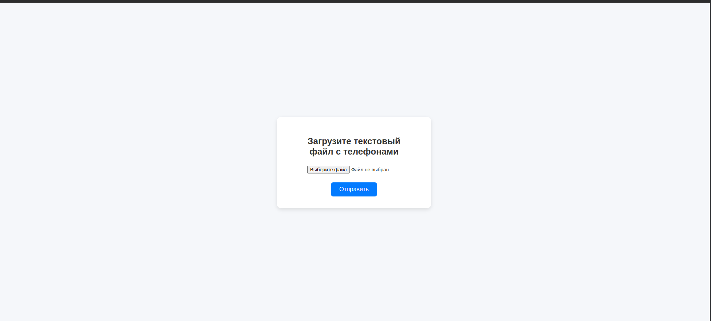

# 📞 Phone Extractor API

Веб-приложение на FastAPI для извлечения российских телефонных номеров из загруженных текстовых файлов.

---

## 📁 Структура проекта
```Agronaut/
│
├── app/
│ ├── main.py # Точка входа FastAPI
│ ├── service.py # Логика извлечения телефонов
│ ├── middleware.py # Middleware для глобальной обработки ошибок
│ ├── static/ # CSS и другие статические файлы
│ └── templates/ # HTML-шаблоны (форма загрузки)
│
├── assets/
│   └── img.png              # Скриншот формы
│
├── Dockerfile # Docker-образ (backend)
├── docker-compose.yml # docker-compose (backend + nginx)
├── nginx/
| ├── Dockerfile # Docker-образ (nginx)
│ └── nginx.conf # Конфигурация nginx
├── pyproject.toml # Зависимости проекта
├── uv.lock # Файл зависимостей uv
├── .python-version # Версия Python (например, 3.11)
├── .gitignore
└── README.md # Документация проекта
```

---

### 📦 Установка

Проект использует [uv](https://github.com/astral-sh/uv) как менеджер пакетов. Убедись, что `uv` установлен:

```bash
curl -LsSf https://astral.sh/uv/install.sh | sh
```

---

## 🚀 Быстрый старт с Docker
docker-compose up --build

После запуска API будет доступен по адресу:
```bash
📍 http://localhost:8005
```

---

## 🧪 Использование
🌐 Веб-интерфейс
Открывается по адресу /.
Позволяет загрузить текстовый файл (.txt) и получить список найденных телефонных номеров.

---

## 📡 API
```bash
POST /extract-phones/
```

Формат запроса: multipart/form-data с полем file

Формат ответа json:
```bash
{
  "phones": ["+7(999)123-45-67", "+7(495)765-43-21"]
}
```
Если номера не найдены:
```bash
{
  "message": "Телефонные номера не найдены."
}
```

---

## ⚠️ Обработка ошибок
Сервис возвращает понятные сообщения и статус-коды в случае ошибок:

400 Bad Request: файл не текстовый, пустой или не в UTF-8

500 Internal Server Error: внутренняя ошибка сервера

---

## 💻 Пример содержимого файла
```bash
Позвоните нам по номеру: +7 (495) 123-45-67
или по короткому: 8-800-200-00-00
```

---

## 🖼️ Интерфейс

Форма для загрузки текстового файла:


